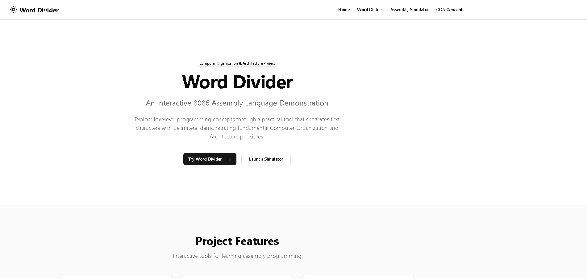
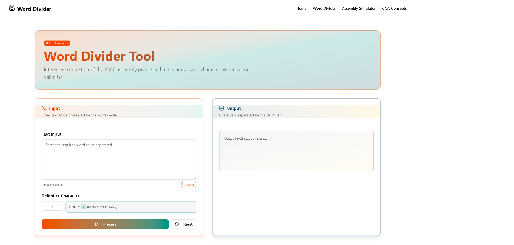
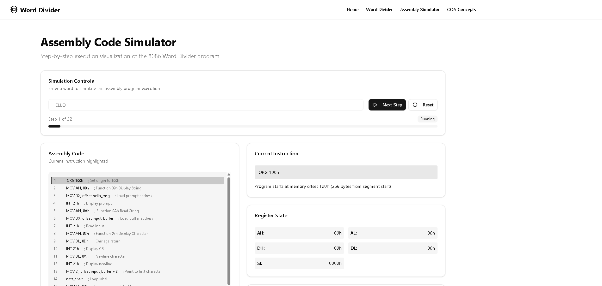

# Word Divider GUI

An interactive Next.js GUI for exploring and experimenting with word-division algorithms and related assembly-level tooling. This repository contains a modern UI built with React/Next.js and a set of small utilities to demonstrate how words can be divided, visualized, and adjusted in different contexts.

## 📸 Screenshots

Homepage



Word Divider view



Assembly Simulator view



## Highlights
- Modern Next.js app (app router) with a focused `word-divider` demo.
- Clean component library under `src/components/ui` for shared UI primitives.
- Small, testable utility functions under `src/lib`.

## Tech stack
This project uses a modern React/Next.js stack with TypeScript and Tailwind for styling. Notable libraries and tools used in the repository include:

- Core: Next.js (app router, v15.3.5), React (v19), TypeScript (v5)
- Styling: Tailwind CSS (v4), `tailwind-merge`, `@tailwindcss/typography`, `tailwindcss-animate`
- UI primitives: Radix UI components (`@radix-ui/*`), Headless UI, Heroicons, Lucide, `@tabler/icons-react`
- Forms & validation: `react-hook-form`, `@hookform/resolvers`, `zod`
- Animation & motion: Framer Motion, `motion`, `motion-dom`
- 3D & visuals: Three.js, `@react-three/fiber`, `@react-three/drei`, `three-globe`
- Charts & UI extras: Recharts, Swiper, Sonner (toasts), `react-syntax-highlighter`
- Data & backend helpers: Drizzle ORM / `drizzle-kit`, `@libsql/client`, `vaul`
- Utilities: `clsx`, `date-fns`, `mini-svg-data-uri`, `react-wrap-balancer`
- Other integrations: Stripe SDK (`stripe`), `bcrypt` (auth helpers)
- Dev tooling: ESLint, Next's built-in tooling (turbopack for dev), Tailwind + PostCSS

See `package.json` for the complete and current list of dependencies and exact versions.

## Quick contract
- Inputs: user-provided text or sample inputs via the Word Divider page.
- Outputs: visualized divisions, downloadable/exportable results (UI displayed).
- Error modes: invalid input (sanitized/validated), empty inputs handled gracefully.

## Getting started
These commands assume you have Node.js installed (v16+ recommended). The repo uses standard npm scripts; replace with `pnpm` or `yarn` if you prefer.

Clone the repository and install dependencies

```pwsh
# Clone the repo 
git clone https://github.com/rishit-exe/Word-Divider-GUI.git
cd Word-Divider-GUI

# Install dependencies
npm install
```

Run the dev server

```pwsh
npm run dev
```

Open http://localhost:3000 in your browser. The `word-divider` demo is available at `/word-divider`.

Build for production

```pwsh
npm run build
npm start
```

## Project structure
- `src/app` — Next.js app routes and pages.
- `src/components` — Shared UI components and layout (Header, Footer, UI primitives).
- `src/lib` — Utilities and hooks used across the app.
- `public/screenshots` — Place screenshots here.

## Development notes & small checklist
- Add unit tests for `src/lib/utils.ts` when changing logic.
- Keep UI components small and stateless where possible.

## License
This project is licensed under the terms in the [LICENSE](./LICENSE) file.

## Contact & Contributors
Repository owner
- [rishit-exe](https://www.linkedin.com/in/the-rishit-srivastava)

Contributors
- [AniA16051](https://github.com/AniA16051)
- [definitelynotnakul](https://github.com/definitelynotnakul)